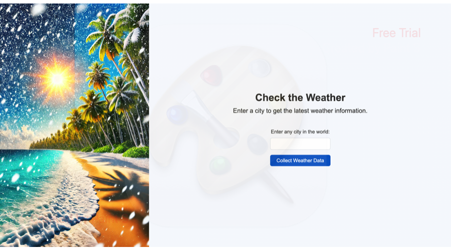
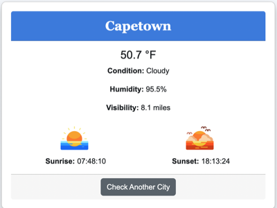

# Weather Application

A Python-based application that checks the weather for a specified location. It first checks a Redis cache for recent data. If the weather data is not cached, the application fetches the data from a third-party weather API and caches the data for future requests. This reduces API calls, speeds up responses, and supports a better user experience.

The application obtains data from [Visiual Crossing's API](https://www.visualcrossing.com/weather-api).

## Table of Contents

- [Installation](#installation)
- [Usage](#usage)
- [Features](#features)
- [Configuration](#configuration)
- [Dependencies](#dependencies)
- [Troubleshooting](#troubleshooting)
- [Contributing](#contributing)
- [License](#license)

## Installation

1. **Clone the Repository**
   
   ```
   git clone https://github.com/Morgan-Sell/weather-api.git
   cd weather-api
   ```

2. **Environment Variables:** Set up a .env file in the root directory of the project with the following variable.
    
    ```
    API_KEY=<your_weather_api_key>

    ```

3. **Run Initial Setup:** Use the provided run.sh script for setting up your environment.

    ```
    ./run.sh initial-setup
    ```

## Usage

### Starting the Application

To start the application, run the following command:

    ```
    ./run.sh run-app
    ```

This will:

- Start a Redis server if it is not already running.
- Load the environment variables.
- Run the main application script located in `src/main.py`.

## Application Walkthrough

### 1. Launching the Application
When you access http://127.0.0.1:5001 via your web browser, you'll be greeted by the home page.

<p align="center">
    
</p>

### 2. Submit Location
Enter the name of your desired city into text box.

<p align="center">
    
</p>

### 3. See the Results
Select "Collect Weather Data" and you will be directing to the current weather for your selected location.

<p align="center">
    
</p>

### Available Commands

You can manage the environment and dependencies using `run.sh`:

- **Run the application:** `./run.sh run-app`
- **Set up virtual environment:** `./run.sh setup-venv`
- **Install dependencies:** `./run.sh install-deps`
- **Load environment variables:** `./run.sh load-env`

## Features
- **Weather Caching:** Checks for cached weather data in Redis before making API requests, reducing redundant calls and improving response times.
- **Cross-Platform Support:** Works on Windows, macOS, and Linux.
- **Easy Setup:** Simple bash script for environment setup, dependency installation, and application management.

## Configuration
- **Redis Configuration:** The application relies on Redis to cache weather data. The Redis server starts automatically through run.sh, but you may need to ensure it is accessible and configured properly.

- **Weather API Key:** Obtain an API key from your preferred weather service provider and add it to the .env file.